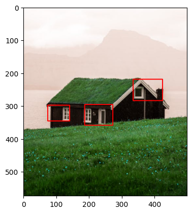

# Image Processing Algorithms
This image processing project showcases the implementation of fundamental techniques and algorithms for feature extraction, edge detection, and shape recognition. The project includes Python notebooks demonstrating the practical application of various methods, including:

  

### Thresholding
Thresholding segments images by setting pixel values above or below a certain threshold. It creates binary images where pixel values are classified as foreground or background based on intensity.

---
### Gamma Correction
Illustrates the implementation of gamma correction to adjust the brightness and contrast of images, enhancing visual quality and improving overall appearance: 

  $O=I^γ$

  where:
  
  - $O$ represents the output intensity after gamma correction.
  - $I$ is the input intensity value of the pixel.
  - $γ$ is the gamma value, typically ranging from 0.1 to 5.0.

---
### Histogram Equalization
Histogram equalization redistributes pixel intensities in an image to improve contrast and enhance details. It stretches the histogram to cover a wider intensity range.

  
 
  $G(x, y) = round\left(\frac{{CDF(I(x, y)) - CDF_{\text{min}}}}{{(M \times N) - CDF_{\text{min}}}} \times (L-1)\right)$ 
  

  
  where:
  - $I(x, y)$ represents the original pixel intensity at coordinates $ (x, y) $.
  - $CDF(I(x, y))$ is the cumulative distribution function of pixel intensities.
  - $CDF_{\text{min}}$ is the minimum non-zero value in the CDF.
  - $M$ and $N$ are the dimensions of the image.

---
### Unsharp Masking
Unsharp masking sharpens images by subtracting a blurred version of the image from the original. It enhances edge details by emphasizing the differences between pixel values.

  

  $g(x, y) = f(x, y) + c×(f(x, y) − b(x, y))$
  

  where:
  
  - $g(x, y)$ is the output image.
  - $b(x, y)$ is the Blurred image, a smoothed version of the original image.
  - $c$ represents the strength of the sharpening effect, often controlled by a scalar value.

---
### High Boost Filtering
High boost filtering sharpens images by combining the original image with a high-pass filtered version of itself. It enhances edges and details by emphasizing high-frequency components.

$h(x, y) = Af(x, y) - l(x, y)$

where:

- $h(x, y)$ is the output high boost image.
- $f(x, y)$ is the original image.
- $l(x, y)$ is a Low Pass Filtered image of the original image.
- $A$ is a constant value that determines the strength of the enhancement

---
### Canny Edge Detection
Canny Edge Detection is an algorithm used for detecting edges in images. It involves multiple steps including Gaussian smoothing to reduce noise, gradient calculation to find edge strengths and directions, non-maximum suppression to thin edges, and double thresholding to classify strong, weak, and non-edges.

Here's it's mathematical pipeline:

1. **Gaussian Smoothing**: 

  $G(x, y) = \frac{1}{2πσ^2} × e^-\frac{x^2+y^2}{2σ^2}$

2. **Gradient Calculation**:
  The gradient magnitude $M$ and direction $θ$ are calculated with: 

  $M = (G^2_x + G^2_y)^\frac{1}{2}$
 

  $θ = arctan(\frac {G_y}{G_x})$

  where:
    - $G_x$ and $G_y$ are the image gradients in the $x$ and $y$ directions, typically computed using Sobel or Prewitt operators.
3. **Non-Maximum Suppression**:
  This step retains only the local maximum pixel values in the gradient direction. A comparison of gradient magnitude values is calculated in the direction of the gradient to preserve only local maxima.
4. **Double Thresholding**:
  The double thresholding involves setting two thresholds, a high threshold $(T_high)$ and a low threshold $(T_low)$. Pixels with gradient magnitudes above $(T_high)$ are marked as strong edges, while pixels with gradient magnitudes below $T_low$ are considered non-edges, and finally pixels with values between the thresholds are classified as weak edges.
5. **Edge Tracking by Hysteresis**:
  Weak edge pixels that are connected to strong edges are considered part of the edge. There's no specific equation here, but it involves traversing the image and linking weak edges to strong edges based on connectivity.

---
### Harris Corner Detector
The Harris Corner Detector identifies corners or interest points in images by analyzing variations in intensity in multiple directions. It computes the corner response function by comparing the local intensity variations in a windowed area. The key steps involved in the Harris Corner Detector algorithm are as follows:

  1. **Intensity Gradient Calculation**:
  First you compute the gradients in both the $x$ and $y$ directions using, for example, Sobel or Prewitt operators. Then, you calculate the gradient products $I^2_x$, $I^2_y$, and $I_{xy}$.
  2. **Summation of Products of Gradients**:
  First you apply a Gaussian window to these gradients products to weigh their contributions in a local neighborhood and then you calculate the sums of products of gradients for each pixel using a Gaussian-weighted window.
  3. **Corner Response Function**:
  For each pixel, compute the corner response function using the formula:

  $R=Det(M)-kTrace^2(M)$

  
  where:
  - $Det(M)$ is the determinant of the structure tensor $M$.
  - $Trace^2(M)$ is the squared trace of $M$.
  - $k$ is an empirical constant usually set between 0.04 to 0.06. It helps differenetiate between corners and edges.
  4. **Corner Localization**: Detect potential corner by selecting pixels where $R$ exceeds a certain threshold and then apply non-maximum suppression to ensure that nearby pixels with similar responses are not all considered as corners.

---
### Hough Transform for Line Detection
The Hough Transform detects straight lines by representing them in parameter space $(r, θ)$. It accumulates votes in the parameter space to find peaks, which indicate lines in the image. Hough Transform involves the representation of points in the image space $(x, y)$ as lines in the Hough space $(r, θ)$ using the line equation:

$r = xcos(θ) + ysin(θ)$

---
### Laplacian of Gaussian (LoG)
LoG detects edges by convolving the image with a Gaussian kernel and then applying the Laplacian operator. It enhances edge details by combining the effects of smoothing and edge detection.

1. **Gaussian Blur**:
- First, the image is convolved (mathematically combined) with a Gaussian kernel.
- The Gaussian kernel is a 2D matrix that emphasizes the center and decreases values as it moves away from the center, creating a blur effect.
- This step helps in smoothing or blurring the image and reducing noise.
- The equation for a 2D Gaussian function is:

$G(x, y) = \frac{1}{2πσ^2} × e^-\frac{x^2+y^2}{2σ^2}$

  where: 
  
  - $G(x, y)$ represents the value of the Gaussian function at position $(x, y)$ in the kernel.
  - $σ$ is the std determining the spread of the Gaussian.

To perform Gaussian smoothing on an image, the image is convolved with a Gaussian kernel, applying the above equation to each pixel. The resulting image is a smoothed or blurred version of the original.

2. **Laplacian Operator**:
- After blurring the image with the Gaussian filter, the Laplacian operator (often represented by a $3x3$ or $5x5$ kernel) is applied to the smoothed image.
- The Laplacian operator computes the second derivative of the image. It highlights regions where the intensity changes rapidly, which often corresponds to edges or boundaries in the image.
- This step enhances the edges and helps identify the locations of significant intensity variations.

The Laplacian operator, which computes the second derivative of an image, is oftren reepresented by a $3x3$ kernel. 

---
The project notebook provides clear explanations, code implementations in Python using common libraries like OpenCV or custom implementations, and visual demonstrations to understand and apply these image processing techniques effectively.

Explore these notebooks to understand, implement, and experiment with essential image processing algorithms for feature extraction, edge detection, and shape recognition.

## License
This project is licensed under the MIT License - see the [LICENSE](LICENSE) file for details.
