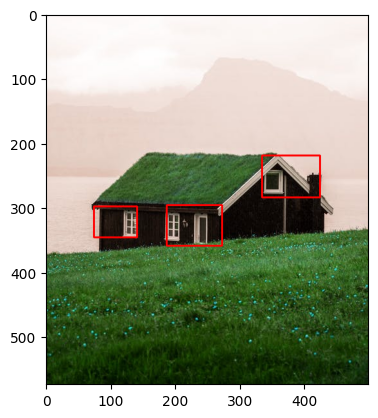

# Image Processing Algorithms

A cleaned Python/Jupyter portfolio project implementing classical image processing and computer vision algorithms for image enhancement, filtering, edge detection, feature extraction, and line detection.

<p align="center">
  
</p>

## Algorithms

| Algorithm | Category | What it demonstrates |
| --- | --- | --- |
| Thresholding | Image segmentation | Converts grayscale intensity ranges into binary or quantized regions using threshold rules. |
| Gamma Correction | Image enhancement | Adjusts image brightness and contrast with a nonlinear intensity transformation. |
| Histogram Equalization | Contrast enhancement | Redistributes intensity values to improve contrast in low-contrast images. |
| Unsharp Masking | Image sharpening | Enhances edges by combining the original image with details extracted from a blurred version. |
| High-Boost Filtering | Image sharpening | Amplifies high-frequency image detail while retaining the original image structure. |
| Canny Edge Detection | Edge detection | Detects edges through smoothing, gradient estimation, non-maximum suppression, and thresholding. |
| Harris Corner Detector | Feature detection | Identifies corner-like interest points from local intensity changes. |
| Hough Transform for Line Detection | Shape and line detection | Detects straight lines by voting in a parameter space. |
| Laplacian of Gaussian | Edge detection and filtering | Combines Gaussian smoothing with second-derivative edge detection. |

## Relevance

This project demonstrates practical foundations in image processing and classical computer vision, including contrast enhancement, filtering, edge detection, feature detection, and shape/line detection. The notebook focuses on readable implementations and visual interpretation of core techniques that are commonly used as building blocks in more advanced computer vision workflows.

## Academic and Portfolio Context

This is a cleaned portfolio project created from implementation practice and self-study/coursework-style exercises. It is intended to show familiarity with classical image processing concepts and Python-based experimentation. It is not presented as peer-reviewed research or production-level software.

## How to Run

Create and activate a virtual environment:

```bash
python -m venv .venv
source .venv/bin/activate
```

On Windows PowerShell, activate the environment with:

```powershell
.venv\Scripts\activate
```

Install dependencies and launch Jupyter:

```bash
pip install -r requirements.txt
jupyter notebook
```

Then open `image_processing_algorithms.ipynb` from the Jupyter file browser.

## Repository Contents

| Path | Description |
| --- | --- |
| `image_processing_algorithms.ipynb` | Main Jupyter notebook containing implementations, formulas, and visual examples. |
| `assets/images/` | Image assets used by the README and notebook examples. |
| `requirements.txt` | Python dependencies needed to run the notebook. |
| `CLEANUP_REPORT.md` | Summary of cleanup actions, validation status, and manual review items. |
| `LICENSE_OR_NOTICE.md` | Cautious notice for portfolio use and third-party materials. |

## Notes

The notebook relies on local images in `assets/images/`. If images are moved or renamed, update the corresponding paths in the notebook before running it.
